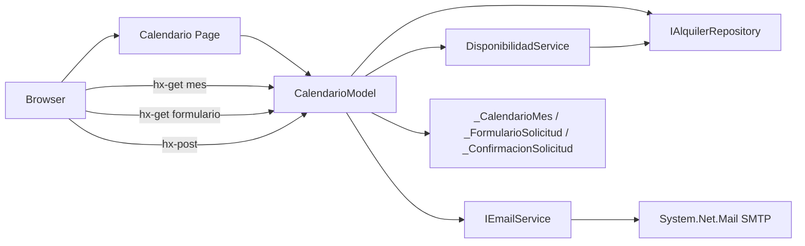
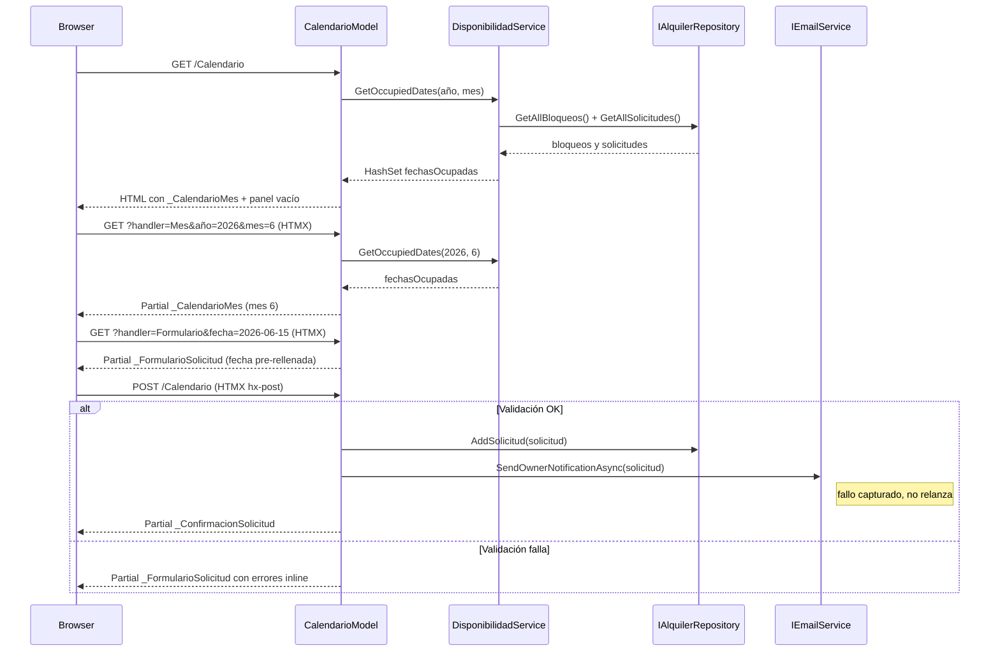

# Design Document: calendario-solicitudes

## Overview

Este spec añade el calendario público de disponibilidad y el flujo de solicitud de alquiler al sitio. Los visitantes consultan la disponibilidad mensual, seleccionan una fecha disponible, rellenan el formulario de solicitud y reciben una confirmación inmediata. El propietario recibe un email de aviso con los datos de cada nueva solicitud.

**Users**: Visitantes del sitio que quieren comprobar disponibilidad y enviar una solicitud de alquiler.  
**Impact**: Añade cuatro Razor Pages/partials, dos servicios inyectables (`DisponibilidadService`, `SmtpEmailService`) y un modelo de formulario validado. Modifica `appsettings.json` para añadir configuración SMTP.

### Goals
- Calendario mensual con disponibilidad correctamente calculada (bloqueos + solicitudes aprobadas)
- Navegación entre meses sin recarga completa vía HTMX
- Formulario de solicitud cargado al clicar una fecha disponible, con validación server-side inline
- Solicitud guardada en repositorio con estado `Pendiente` en cada envío válido
- Email de aviso al propietario enviado tras cada solicitud exitosa (fallo no bloquea el flujo)
- Confirmación inmediata al cliente vía partial HTMX

### Non-Goals
- Aprobación o rechazo de solicitudes (responsabilidad de `panel-administracion`)
- Gestión de bloqueos de fechas por el admin (`panel-administracion`)
- Email de confirmación al cliente (`panel-administracion`)
- Pago online, hora exacta de evento, recordatorios automáticos

---

## Boundary Commitments

### This Spec Owns
- `Pages/Calendario.cshtml` y `Pages/Calendario.cshtml.cs` — página maestra con todos los handlers HTMX y el handler POST del formulario
- `Pages/Shared/_CalendarioMes.cshtml` — partial del grid mensual con disponibilidad (reutilizable por `panel-administracion`)
- `Pages/Shared/_FormularioSolicitud.cshtml` — partial del formulario de solicitud
- `Pages/Shared/_ConfirmacionSolicitud.cshtml` — partial de confirmación tras envío exitoso
- `Services/IDisponibilidadService.cs` + `Services/DisponibilidadService.cs` — contrato y lógica de cálculo de fechas ocupadas
- `Services/IEmailService.cs` + `Services/SmtpEmailService.cs` — contrato y implementación SMTP de notificación al propietario
- `Models/SolicitudInputModel.cs` — modelo de formulario con validación DataAnnotations
- Configuración `EmailSettings` en `appsettings.json`

### Out of Boundary
- Aprobación, rechazo o cualquier cambio de estado de solicitudes (no es `Pendiente` → otro)
- Añadir, editar o eliminar `BloqueoFecha` (gestión admin)
- Email de confirmación/rechazo al cliente
- Vista de calendario con acciones de gestión (responsabilidad de `panel-administracion`)
- Lógica de disponibilidad por máquina específica — la disponibilidad es general (por fecha, no por máquina)

### Allowed Dependencies
- `infraestructura`: `IAlquilerRepository`, `Solicitud`, `BloqueoFecha`, `EstadoSolicitud` (P0)
- `System.Net.Mail` — en el BCL de .NET 10, sin NuGet adicional (P0)
- HTMX 2.x CDN — ya cargado en `_Layout.cshtml` (P0)
- `appsettings.json` — configuración SMTP compartida con el proyecto (P1)

### Revalidation Triggers
- Cambio en `IAlquilerRepository.GetAllSolicitudes()` o `GetAllBloqueos()` → revisar `DisponibilidadService`
- Cambio en `EstadoSolicitud` enum (nuevos estados) → revisar lógica de disponibilidad
- Cambio en propiedades de `Solicitud` → revisar `SolicitudInputModel` y `SmtpEmailService`
- `panel-administracion` que quiera reutilizar `_CalendarioMes.cshtml` debe declarar dependencia explícita

---

## Architecture

### Architecture Pattern & Boundary Map



- **Patrón**: Razor Pages + HTMX multi-handler + Service Layer. `CalendarioModel` es el orquestador; `DisponibilidadService` encapsula la lógica de disponibilidad; `IEmailService` desacopla la implementación SMTP.
- **Handlers HTMX**: `OnGetMes(int año, int mes)`, `OnGetFormulario(DateOnly fecha)` y `OnPost()` en `CalendarioModel` — cada uno retorna un `PartialViewResult` o `IActionResult`.

### Technology Stack

| Layer | Choice | Role |
|-------|--------|------|
| Backend | ASP.NET Core 10 Razor Pages | PageModel, handlers, routing |
| Frontend | HTMX 2.x CDN | Navegación de mes, carga de formulario, envío HTMX |
| Email | `System.Net.Mail.SmtpClient` (BCL) | Envío de aviso al propietario vía SMTP |
| Data | `IAlquilerRepository` (InMemory) | Lectura de bloqueos/solicitudes, escritura de nueva solicitud |
| Config | `appsettings.json` | Credenciales SMTP, email del propietario |

---

## File Structure Plan

### Directory Structure

```
Pages/
├── Calendario.cshtml              # Página completa: incluye sección de calendario y panel de formulario
├── Calendario.cshtml.cs           # PageModel: OnGet, OnGetMes, OnGetFormulario, OnPost
└── Shared/
    ├── _CalendarioMes.cshtml      # Partial: grid del mes con disponibilidad y clics HTMX
    ├── _FormularioSolicitud.cshtml # Partial: formulario de solicitud con validación inline
    └── _ConfirmacionSolicitud.cshtml # Partial: mensaje de confirmación post-envío
Services/
├── IDisponibilidadService.cs      # Contrato: GetOccupiedDates(int año, int mes)
├── DisponibilidadService.cs       # Lógica: combina BloqueoFecha + Solicitud(Aprobada) → HashSet<DateOnly>
├── IEmailService.cs               # Contrato: SendOwnerNotificationAsync(Solicitud solicitud)
└── SmtpEmailService.cs            # Implementación SMTP con System.Net.Mail
Models/
└── SolicitudInputModel.cs         # Modelo de formulario: campos requeridos + DataAnnotations
```

### Modified Files
- `Program.cs` — registrar `IDisponibilidadService` (Scoped) e `IEmailService` (Singleton), y `EmailSettings` via `IOptions`
- `appsettings.json` — añadir sección `EmailSettings`: `SmtpHost`, `SmtpPort`, `SmtpUser`, `SmtpPassword`, `OwnerEmail`, `SenderEmail`

---

## System Flows

### Flujo completo: calendario → formulario → envío → confirmación



---

## Requirements Traceability

| Req | Summary | Componentes |
|-----|---------|-------------|
| 1 | Calendario con disponibilidad visual | `CalendarioModel.OnGet`, `DisponibilidadService`, `_CalendarioMes.cshtml` |
| 2 | Navegación entre meses sin recarga | `CalendarioModel.OnGetMes`, `_CalendarioMes.cshtml`, HTMX hx-get |
| 3 | Click en fecha disponible → formulario | `CalendarioModel.OnGetFormulario`, `_FormularioSolicitud.cshtml`, HTMX hx-get |
| 4 | Formulario con validación y guardado | `SolicitudInputModel`, `CalendarioModel.OnPost`, `IAlquilerRepository.AddSolicitud` |
| 5 | Confirmación inmediata sin recarga | `CalendarioModel.OnPost` → `_ConfirmacionSolicitud.cshtml` vía HTMX |
| 6 | Email de aviso al propietario | `IEmailService`, `SmtpEmailService`, `EmailSettings` en `appsettings.json` |

---

## Components and Interfaces

| Componente | Capa | Intent | Reqs | Dependencias (P0/P1) | Contratos |
|------------|------|--------|------|----------------------|-----------|
| `CalendarioModel` | Presentación | Orquesta calendario, formulario, envío y confirmación | 1, 2, 3, 4, 5, 6 | `DisponibilidadService` (P0), `IAlquilerRepository` (P0), `IEmailService` (P1) | State |
| `DisponibilidadService` | Servicio | Calcula fechas ocupadas combinando bloqueos y solicitudes aprobadas | 1, 2 | `IAlquilerRepository` (P0) | Service |
| `SmtpEmailService` | Servicio | Envía email SMTP al propietario al recibir nueva solicitud | 6 | `System.Net.Mail` (P0), `EmailSettings` config (P0) | Service |
| `SolicitudInputModel` | Modelo | Modelo de formulario con validación DataAnnotations | 4 | `Maquina` list para selector (P1) | State |
| `_CalendarioMes.cshtml` | UI Partial | Grid mensual con estados visuales y triggers HTMX | 1, 2, 3 | `DisponibilidadService` results (P0) | — |
| `_FormularioSolicitud.cshtml` | UI Partial | Formulario de solicitud con errores inline | 3, 4 | `SolicitudInputModel` (P0) | — |
| `_ConfirmacionSolicitud.cshtml` | UI Partial | Mensaje de confirmación post-envío exitoso | 5 | — | — |

### Capa Servicio

#### DisponibilidadService

| Field | Detail |
|-------|--------|
| Intent | Calcula el conjunto de fechas ocupadas para un mes dado, combinando BloqueoFecha y Solicitud con estado Aprobada |
| Requirements | 1, 2 |

**Contracts**: Service [x]

```csharp
public interface IDisponibilidadService
{
    HashSet<DateOnly> GetOccupiedDates(int año, int mes);
}
```
- **Preconditions**: `año` y `mes` válidos (1–12).
- **Postconditions**: Devuelve todas las fechas del mes que caen dentro de algún `BloqueoFecha.FechaInicio..FechaFin` o dentro de alguna `Solicitud` con `Estado == EstadoSolicitud.Aprobada`. Nunca devuelve `null`.
- **Invariants**: No modifica el repositorio.

**Implementation Notes**
- Itera sobre `GetAllBloqueos()` y `GetAllSolicitudes()` filtrando por `Estado == Aprobada`.
- Para cada registro, expande el rango `FechaInicio..FechaFin` en días individuales y los añade al `HashSet<DateOnly>`.
- Registrar como `Scoped` en DI (una instancia por request).

---

#### SmtpEmailService

| Field | Detail |
|-------|--------|
| Intent | Envía un email de aviso al propietario con los datos de cada nueva solicitud via SMTP |
| Requirements | 6 |

**Contracts**: Service [x]

```csharp
public interface IEmailService
{
    Task SendOwnerNotificationAsync(Solicitud solicitud);
}
```
- **Preconditions**: `solicitud` no es null; `EmailSettings` está configurado en `appsettings.json`.
- **Postconditions**: Email enviado al `OwnerEmail` configurado. Si falla, captura la excepción silenciosamente (logging de error, sin relanzar).
- **Invariants**: No modifica el repositorio ni el estado de la solicitud.

**EmailSettings** (sección en `appsettings.json`):
```json
{
  "EmailSettings": {
    "SmtpHost": "localhost",
    "SmtpPort": 1025,
    "SmtpUser": "",
    "SmtpPassword": "",
    "OwnerEmail": "propietario@ejemplo.com",
    "SenderEmail": "noreply@rentingbartops.com"
  }
}
```

**Implementation Notes**
- Usar `IOptions<EmailSettings>` para leer la configuración.
- `System.Net.Mail.SmtpClient` con `EnableSsl = false` para desarrollo (Mailtrap/Mailhog en localhost). Documentar que en producción se debe habilitar TLS.
- Registrar `IEmailService` como `Singleton` en DI.
- Risks: `SmtpClient` obsolescente en algunas advertencias de .NET — funcional en .NET 10; candidato a reemplazo por MailKit en fase de producción.

---

#### CalendarioModel

| Field | Detail |
|-------|--------|
| Intent | Orquesta todos los flujos del calendario: renderizado inicial, navegación de mes, carga de formulario, envío y confirmación |
| Requirements | 1, 2, 3, 4, 5, 6 |

**Contracts**: State [x]

```csharp
public class CalendarioModel : PageModel
{
    [BindProperty]
    public SolicitudInputModel Input { get; set; } = new();

    public HashSet<DateOnly> FechasOcupadas { get; private set; } = new();
    public int MesActual { get; private set; }
    public int AñoActual { get; private set; }

    public void OnGet();
    public IActionResult OnGetMes(int año, int mes);
    public IActionResult OnGetFormulario(DateOnly fecha);
    public async Task<IActionResult> OnPostAsync();
}
```
- `OnGet()`: carga el mes actual, calcula disponibilidad, renderiza página completa.
- `OnGetMes(año, mes)`: recalcula disponibilidad, retorna `Partial("_CalendarioMes", this)`.
- `OnGetFormulario(fecha)`: verifica que `fecha` no esté ocupada ni pasada; retorna `Partial("_FormularioSolicitud", Input)` con fecha pre-asignada.
- `OnPostAsync()`: si `ModelState.IsValid`, crea `Solicitud`, llama `AddSolicitud`, invoca `SendOwnerNotificationAsync` (en try/catch), retorna `Partial("_ConfirmacionSolicitud")`. Si no válido, retorna `Partial("_FormularioSolicitud", Input)` con errores.

---

#### SolicitudInputModel

| Field | Detail |
|-------|--------|
| Intent | Modelo de formulario tipado con validación para la solicitud de alquiler |
| Requirements | 4 |

**Contracts**: State [x]

```csharp
public class SolicitudInputModel
{
    [Required] public string NombreCliente { get; set; } = string.Empty;
    [Required, EmailAddress] public string EmailCliente { get; set; } = string.Empty;
    [Required] public string TelefonoCliente { get; set; } = string.Empty;
    [Required] public DateOnly FechaEvento { get; set; }
    [Required] public string MaquinaDeseada { get; set; } = string.Empty;
    [Required] public string DuracionEvento { get; set; } = string.Empty;
    public string? NotasAdicionales { get; set; }
}
```

**Implementation Notes**
- `MaquinaDeseada` como `string` libre o selector (el diseño de la vista decide). En esta fase, campo de texto o selector de las máquinas del repositorio.
- `FechaEvento` se pre-rellena desde `OnGetFormulario`.

---

## Error Handling

### Error Strategy
- **Validación de formulario**: `ModelState.IsValid` en `OnPostAsync`. Si falla, `Partial("_FormularioSolicitud")` con `asp-validation-for` muestra errores inline. La solicitud no se guarda.
- **Fecha no disponible en OnGetFormulario**: si el visitante manipula la URL para una fecha ocupada, retorna `Content("<p>Fecha no disponible.</p>", "text/html")` en lugar del formulario.
- **Fallo de email**: `SendOwnerNotificationAsync` envuelto en `try/catch`; fallo logueado con `ILogger`, no relanzado. La solicitud ya está guardada y el cliente ve confirmación.

---

## Testing Strategy

- **Unit tests**:
  - `DisponibilidadService.GetOccupiedDates`: fecha dentro de `BloqueoFecha` marcada como ocupada.
  - `DisponibilidadService.GetOccupiedDates`: fecha dentro de `Solicitud` Aprobada marcada como ocupada.
  - `DisponibilidadService.GetOccupiedDates`: fecha sin bloqueo ni solicitud aprobada marcada como disponible.
  - `CalendarioModel.OnGetFormulario(fechaOcupada)`: retorna mensaje de "no disponible".
  - `CalendarioModel.OnPostAsync` con `ModelState` inválido: no llama `AddSolicitud`.

- **Integration tests**:
  - `GET /Calendario` devuelve HTTP 200 con HTML del calendario del mes actual.
  - `GET /Calendario?handler=Mes&año=2026&mes=6` devuelve partial HTML con el mes de junio.
  - `GET /Calendario?handler=Formulario&fecha=2026-06-20` devuelve partial con el formulario y la fecha pre-rellenada.
  - `POST /Calendario` con datos válidos: HTTP 200, solicitud guardada en repositorio con estado Pendiente, retorna partial de confirmación.
  - `POST /Calendario` con email inválido: retorna partial de formulario con error de validación, sin solicitud guardada.

- **E2E**:
  - El visitante navega a `/Calendario`, ve el mes actual, hace click en "siguiente mes", ve el mes siguiente sin recarga.
  - El visitante hace click en fecha disponible, aparece el formulario; rellena datos correctos y envía; aparece confirmación inmediata.
  - El visitante intenta enviar formulario vacío; ve errores inline.
