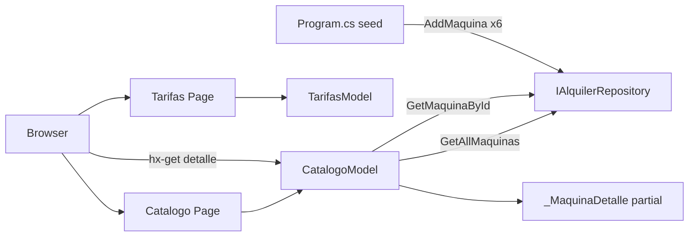
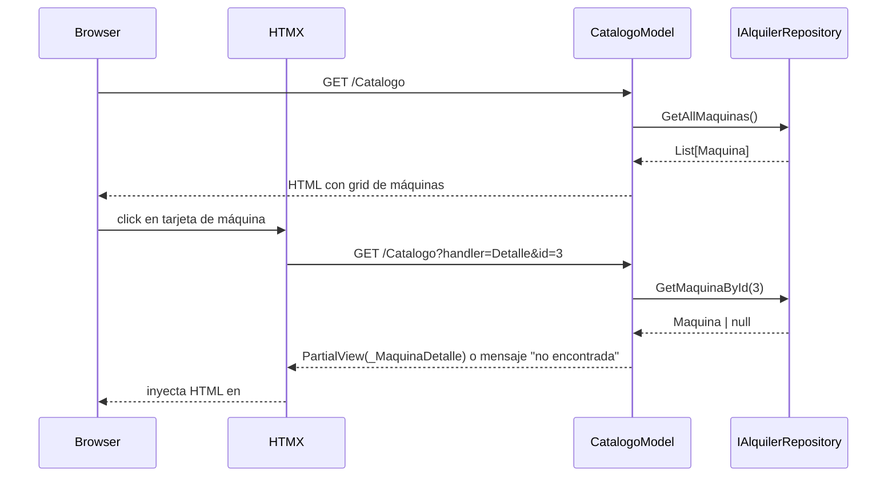

# Design Document: catalogo-tarifas

## Overview

Este spec añade las páginas de catálogo y tarifas al sitio de alquiler de máquinas recreativas. Los visitantes pueden explorar las 6 máquinas disponibles agrupadas por categoría (Grande / Pequeña), ver el detalle de cada máquina sin recargar la página, y consultar la tabla de precios antes de solicitar un alquiler.

**Users**: Visitantes del sitio que evalúan opciones antes de hacer una solicitud de alquiler.  
**Impact**: Añade dos Razor Pages nuevas (`Catalogo`, `Tarifas`), una partial de detalle cargada vía HTMX, y el seed de datos de las 6 máquinas en el repositorio.

### Goals
- Catálogo con 6 máquinas visibles agrupadas por categoría desde el primer arranque
- Vista de detalle cargada parcialmente con HTMX (sin recarga completa de página)
- Página de tarifas con precios diferenciados por categoría y duración
- Seed de 6 máquinas disponible automáticamente al iniciar la aplicación

### Non-Goals
- Edición o creación de máquinas desde la web (fuera de scope)
- Carrito de compra o pago online
- Formulario de solicitud (responsabilidad de `calendario-solicitudes`)
- Lógica de disponibilidad (responsabilidad de `calendario-solicitudes`)

---

## Boundary Commitments

### This Spec Owns
- `Pages/Catalogo.cshtml` y `Pages/Catalogo.cshtml.cs` — listado agrupado y handler HTMX de detalle
- `Pages/Tarifas.cshtml` y `Pages/Tarifas.cshtml.cs` — página de precios estáticos
- `Pages/Shared/_MaquinaDetalle.cshtml` — partial de detalle de máquina (cargado por HTMX)
- Seed de 6 máquinas en `Program.cs` (añadido tras `builder.Build()`)
- Enlace CTA a `calendario-solicitudes` (no implementa ese flujo)

### Out of Boundary
- Creación, edición o eliminación de máquinas desde la interfaz web
- Lógica de disponibilidad de fechas (responsabilidad de `calendario-solicitudes`)
- Formulario de solicitud de alquiler
- Gestión de imágenes reales (se usan placeholders)

### Allowed Dependencies
- `infraestructura`: tipos `Maquina`, `CategoriaMaquina`, `IAlquilerRepository` (P0)
- HTMX 2.x CDN — ya cargado en `_Layout.cshtml` por `infraestructura` (P0)
- `wwwroot/css/site.css` — estilos globales de `infraestructura` (P1)

### Revalidation Triggers
- Cambio de propiedades en `Maquina` (nombre, categoría, precio) → revisar Catalogo y Tarifas
- Cambio en la firma de `IAlquilerRepository.GetAllMaquinas()` o `GetMaquinaById()` → revisar CatalogoModel
- Cambio de ruta de `_Layout.cshtml` o namespace en `_ViewImports.cshtml` → revisar partials

---

## Architecture

### Architecture Pattern & Boundary Map

Razor Pages con handler HTMX para carga parcial. La dirección de dependencia sigue el patrón establecido por infraestructura: **Dominio → Datos → Presentación**.



- **Patrón seleccionado**: Razor Pages + HTMX handler pattern. `OnGetDetalle(int id)` en `CatalogoModel` devuelve una `PartialViewResult` que HTMX inyecta en el DOM sin recargar la página.
- **Seed**: 6 máquinas añadidas en `Program.cs` tras `builder.Build()`, resolviendo `IAlquilerRepository` del contenedor DI.

### Technology Stack

| Layer | Choice | Role |
|-------|--------|------|
| Backend | ASP.NET Core 10 Razor Pages | PageModels, handlers HTMX, routing |
| Frontend | HTMX 2.x CDN + HTML/CSS | Carga parcial de detalle, navegación fluida |
| Data | `IAlquilerRepository` (InMemory) | Lectura de máquinas y seed |
| Runtime | .NET 10 | Compilación y ejecución |

---

## File Structure Plan

### Directory Structure

```
Pages/
├── Catalogo.cshtml           # Vista: grid de máquinas agrupado por categoría; panel de detalle HTMX
├── Catalogo.cshtml.cs        # PageModel: OnGet() + OnGetDetalle(int id)
├── Tarifas.cshtml            # Vista: tabla de precios estáticos diferenciados por categoría/duración
├── Tarifas.cshtml.cs         # PageModel: OnGet() mínimo sin lógica
└── Shared/
    └── _MaquinaDetalle.cshtml  # Partial: detalle de máquina (nombre, descripción, categoría, precio, foto)
```

### Modified Files
- `Program.cs` — añadir seed de 6 máquinas tras `var app = builder.Build()`

---

## System Flows

### Carga parcial de detalle de máquina



---

## Requirements Traceability

| Req | Summary | Componentes |
|-----|---------|-------------|
| 1.1 | GET /Catalogo muestra 6 máquinas agrupadas | `CatalogoModel.OnGet`, `Catalogo.cshtml` |
| 1.2 | Cada máquina muestra foto, nombre, descripción, categoría | `Catalogo.cshtml`, `_MaquinaDetalle.cshtml` |
| 1.3 | Layout responsive | `Catalogo.cshtml` + `site.css` |
| 2.1 | Detalle cargado sin recarga completa | `CatalogoModel.OnGetDetalle`, HTMX hx-get, `_MaquinaDetalle.cshtml` |
| 2.2 | ID inexistente muestra mensaje claro | `CatalogoModel.OnGetDetalle` null-check |
| 3.1 | GET /Tarifas muestra precios por categoría | `Tarifas.cshtml` |
| 3.2 | Precios para al menos 2 duraciones | `Tarifas.cshtml` (tabla estática) |
| 3.3 | CTA a disponibilidad/solicitud | `Tarifas.cshtml` enlace a `/Calendario` |
| 4.1 | 6 máquinas pre-cargadas al arrancar | `Program.cs` seed |
| 4.2 | Cada máquina con ID, nombre, descripción, categoría, imagen, precio | `Program.cs` seed + `AddMaquina` |
| 5.1 | Navegación parcial entre páginas | `hx-boost="true"` en `_Layout.cshtml` |
| 5.2 | Páginas dentro del layout compartido | `_ViewStart.cshtml` → `_Layout.cshtml` |
| 5.3 | Cards visualmente diferenciadas por categoría | `Catalogo.cshtml` + clases CSS por categoría |

---

## Components and Interfaces

| Componente | Capa | Intent | Reqs | Dependencias (P0/P1) | Contratos |
|------------|------|--------|------|----------------------|-----------|
| `CatalogoModel` | Presentación | Orquesta listado y handler de detalle | 1.1, 1.2, 2.1, 2.2, 5.3 | `IAlquilerRepository` (P0) | State |
| `Catalogo.cshtml` | UI | Vista de grid con panel de detalle HTMX | 1.1, 1.2, 1.3, 5.1, 5.3 | `CatalogoModel` (P0) | — |
| `_MaquinaDetalle.cshtml` | UI Partial | Fragmento de detalle inyectado por HTMX | 1.2, 2.1, 2.2 | `Maquina` model (P0) | — |
| `TarifasModel` | Presentación | PageModel mínimo para /Tarifas | 3.1, 3.2, 3.3 | — | — |
| `Tarifas.cshtml` | UI | Tabla de precios estáticos + CTA | 3.1, 3.2, 3.3 | `TarifasModel` (P0) | — |
| Seed en `Program.cs` | Bootstrap | Inicializa 6 máquinas en el repositorio | 4.1, 4.2 | `IAlquilerRepository` (P0) | State |

### Capa Presentación

#### CatalogoModel

| Field | Detail |
|-------|--------|
| Intent | Provee las máquinas agrupadas por categoría al listado y devuelve el detalle de una máquina como partial HTMX |
| Requirements | 1.1, 1.2, 2.1, 2.2, 5.3 |

**Contracts**: State [x]

**State Management**
```csharp
public class CatalogoModel : PageModel
{
    public IReadOnlyList<Maquina> MaquinasGrandes { get; private set; }
    public IReadOnlyList<Maquina> MaquinasPequenas { get; private set; }

    public void OnGet();
    // Retorna PartialViewResult con _MaquinaDetalle o mensaje "no encontrada"
    public IActionResult OnGetDetalle(int id);
}
```
- **Preconditions**: `IAlquilerRepository` resuelto por DI; seed ejecutado antes del primer request.
- **Postconditions**: `OnGet()` siempre popula ambas listas (vacías si no hay datos). `OnGetDetalle()` retorna partial si la máquina existe; retorna fragmento HTML de "no encontrada" si `GetMaquinaById` devuelve null.
- **Invariants**: No modifica datos del repositorio.

**Implementation Notes**
- `OnGetDetalle` usa `return Partial("_MaquinaDetalle", maquina)` cuando la máquina existe.
- Cuando `id` no existe, retorna `Content("<p>Máquina no encontrada.</p>", "text/html")`.

#### Seed en Program.cs

| Field | Detail |
|-------|--------|
| Intent | Inicializa las 6 máquinas en el repositorio en memoria al arrancar la aplicación |
| Requirements | 4.1, 4.2 |

**Contracts**: State [x]

**State Management**
- Se ejecuta una sola vez tras `builder.Build()`, antes de `app.Run()`.
- Resuelve `IAlquilerRepository` del contenedor y llama `AddMaquina` 6 veces.
- 3 máquinas con `Categoria = CategoriaMaquina.Grande`, 3 con `Categoria = CategoriaMaquina.Pequeña`.
- `ImagenUrl` usa placeholder (`/images/placeholder.jpg`) hasta que el propietario suba fotos reales.

---

## Error Handling

### Error Strategy
- `CatalogoModel.OnGetDetalle(id)`: si `GetMaquinaById` devuelve `null`, retorna un fragmento HTML con mensaje de "no encontrada" en lugar de lanzar excepción. La página no se rompe.
- Seed: si el repositorio ya contiene máquinas (arranques futuros con persistencia), el seed debe ser idempotente o condicionado — en esta fase en memoria se ejecuta siempre en arranque limpio, por lo que no es un riesgo.

---

## Testing Strategy

- **Unit tests**:
  - `CatalogoModel.OnGet()` agrupa correctamente las máquinas por categoría (3 grandes, 3 pequeñas).
  - `CatalogoModel.OnGetDetalle(id_válido)` devuelve `PartialViewResult` con la máquina correcta.
  - `CatalogoModel.OnGetDetalle(id_inexistente)` devuelve `ContentResult` con mensaje de "no encontrada".

- **Integration tests**:
  - `GET /Catalogo` devuelve HTTP 200 con HTML que contiene las 6 máquinas.
  - `GET /Catalogo?handler=Detalle&id=1` devuelve HTML del detalle de la máquina 1.
  - `GET /Tarifas` devuelve HTTP 200 con tabla de precios y enlace CTA.

- **E2E**:
  - El usuario navega a `/Catalogo`, ve las 6 máquinas agrupadas, hace clic en una y el detalle aparece sin recarga completa.
  - El usuario navega a `/Tarifas` y ve precios para categoría Grande y Pequeña, y encuentra el enlace a disponibilidad.
