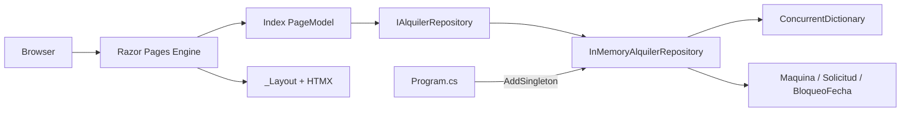
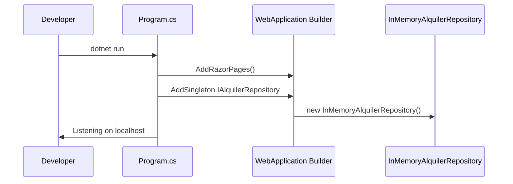
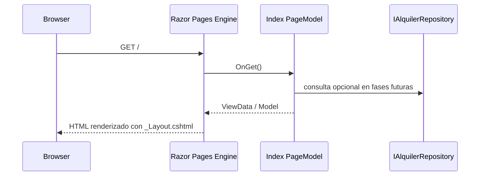
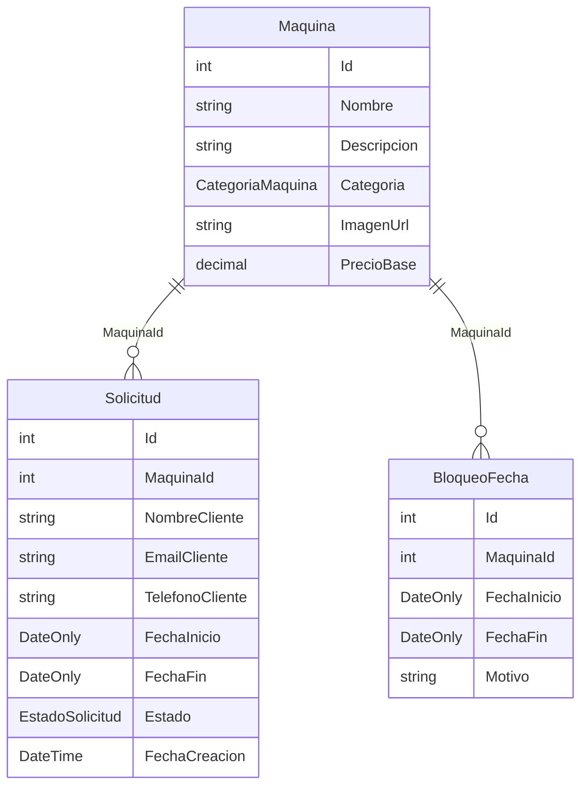

# Design Document: infraestructura

## Overview

Este spec establece la base técnica del sitio de alquiler de máquinas recreativas artesanales. Entrega tres capas fundamentales: los modelos de dominio compartidos (`Maquina`, `Solicitud`, `BloqueoFecha`), la capa de repositorio en memoria con interfaz `IAlquilerRepository` intercambiable, y el layout HTML/CSS con HTMX que todos los specs posteriores heredan.

**Usuarios**: Los visitantes del sitio verán el layout base y la página de inicio. Los desarrolladores de specs downstream consumirán los modelos y la interfaz de repositorio sin depender de la implementación en memoria directamente.

**Impacto**: Crea desde cero el proyecto ASP.NET Core 10, las entidades de dominio, la capa de datos en memoria y la estructura de páginas base. Todos los specs del roadmap (`catalogo-tarifas`, `calendario-solicitudes`, `panel-administracion`) dependen de este spec.

### Goals
- Proyecto ASP.NET Core 10 arrancable con un único comando en localhost
- Entidades de dominio estables y accesibles globalmente desde cualquier área del proyecto
- `IAlquilerRepository` como contrato de datos desacoplado de la implementación
- Layout base con HTMX disponible en todas las páginas sin configuración adicional por página
- Página de inicio funcional como punto de entrada placeholder

### Non-Goals
- Lógica de negocio, catálogo, formularios, calendario o panel de administración
- Persistencia real (SQLite, SQL Server, u otro motor)
- Autenticación o autorización
- Seed data de máquinas (responsabilidad de `catalogo-tarifas`)
- Validación de solapamiento de fechas (responsabilidad de `calendario-solicitudes`)

## Boundary Commitments

### This Spec Owns
- Proyecto ASP.NET Core 10: archivo de proyecto (`.csproj`), `Program.cs`, configuración del pipeline HTTP
- Entidades de dominio: `Maquina`, `Solicitud`, `BloqueoFecha` y sus enumeraciones (`CategoriaMaquina`, `EstadoSolicitud`)
- Contrato de datos: interfaz `IAlquilerRepository` con operaciones CRUD para los tres dominios
- Implementación en memoria: `InMemoryAlquilerRepository` (thread-safe, Singleton en DI)
- Layout base: `_Layout.cshtml` con cabecera, navegación, pie de página, HTMX 2.x CDN y enlace a `site.css`
- Hoja de estilos global: `wwwroot/css/site.css`
- Página de inicio: `Index.cshtml` + `Index.cshtml.cs` (placeholder)

### Out of Boundary
- Lógica de negocio y vistas de funcionalidades (catálogo, tarifas, calendario, solicitudes, panel)
- Implementaciones alternativas del repositorio (SQLite, SQL Server) — diferidas a fase futura
- Autenticación del panel de administración — responsabilidad de `panel-administracion`
- Seed data de entidades — puede añadirse en `Program.cs` pero es responsabilidad del spec que lo requiera primero
- Validación de reglas de negocio (solapamiento de fechas, disponibilidad) — responsabilidad de los specs feature

### Allowed Dependencies
- .NET 10 BCL: `System.Collections.Concurrent` (`ConcurrentDictionary`), `System.Threading` (`Interlocked`)
- `Microsoft.AspNetCore.App` (metapaquete ASP.NET Core 10 — sin NuGet adicionales)
- HTMX 2.x via CDN (unpkg.com/htmx.org) — cargado en `_Layout.cshtml`

### Revalidation Triggers
- Cambio en la firma de `IAlquilerRepository` (añadir, eliminar o modificar métodos) → todos los specs downstream deben verificar compatibilidad
- Cambio de propiedades en `Maquina`, `Solicitud` o `BloqueoFecha` → specs que acceden a esas propiedades
- Cambio de versión mayor de HTMX en `_Layout.cshtml` → specs que usan atributos `hx-*`
- Cambio de clases CSS en `site.css` → specs que dependen de esas clases para su presentación

## Architecture

### Architecture Pattern & Boundary Map

Arquitectura en capas (Layered Architecture) con Razor Pages. La dirección de dependencia es estricta: **Dominio → Datos → Presentación**. Los specs downstream inyectan `IAlquilerRepository` y acceden a los tipos de `Models/`; nunca dependen directamente de `InMemoryAlquilerRepository`.



- **Patrón seleccionado**: Razor Pages + Repository Pattern. Razor Pages encapsula la lógica de presentación por página; el patrón Repository desacopla la capa de datos permitiendo sustituirla sin cambiar las páginas.
- **Specs downstream**: consumen `IAlquilerRepository` (inyectado por DI) y los tipos de `Models/`. No importan `InMemoryAlquilerRepository` directamente.

### Technology Stack

| Layer | Choice | Role |
|-------|--------|------|
| Backend | ASP.NET Core 10 + Razor Pages | Servidor web, routing, renderizado HTML server-side |
| Frontend | HTMX 2.x (CDN) + HTML/CSS | Interactividad sin framework JS; sin npm/bundler |
| Data | `ConcurrentDictionary` (.NET BCL) | Almacenamiento en memoria thread-safe |
| Runtime | .NET 10 SDK | Compilación y ejecución |

## File Structure Plan

### Directory Structure

```
AlquilerMaquinaria/
├── AlquilerMaquinaria.csproj         # Proyecto ASP.NET Core 10; Web SDK; sin NuGet adicionales
├── Program.cs                        # Punto de entrada; DI config; pipeline HTTP
├── Models/
│   ├── Maquina.cs                    # Entidad máquina + enum CategoriaMaquina
│   ├── Solicitud.cs                  # Entidad solicitud + enum EstadoSolicitud
│   └── BloqueoFecha.cs               # Entidad bloqueo de fechas
├── Data/
│   ├── IAlquilerRepository.cs        # Interfaz pública de acceso a datos
│   └── InMemoryAlquilerRepository.cs # Implementación en memoria (ConcurrentDictionary + Interlocked)
├── Pages/
│   ├── Shared/
│   │   └── _Layout.cshtml            # Layout base: header, nav, footer, HTMX CDN script, CSS link
│   ├── _ViewStart.cshtml             # Aplica _Layout.cshtml a todas las páginas por defecto
│   ├── _ViewImports.cshtml           # @addTagHelper Microsoft.AspNetCore.Mvc.TagHelpers; @using namespaces
│   ├── Index.cshtml                  # Página de inicio (placeholder con contenido mínimo)
│   └── Index.cshtml.cs               # PageModel de inicio: OnGet() mínimo sin lógica
└── wwwroot/
    └── css/
        └── site.css                  # Estilos globales: reset, layout, header, nav, footer
```

## System Flows

### Startup y registro DI



### Request a página con layout base



La clave de diseño: `_ViewStart.cshtml` aplica `_Layout.cshtml` globalmente; los specs downstream heredan el layout sin configuración adicional.

## Requirements Traceability

| Req | Resumen | Componentes | Contratos |
|-----|---------|-------------|-----------|
| 1.1 | App responde HTTP en localhost | `Program.cs`, pipeline ASP.NET Core | — |
| 1.2 | Sirve páginas a rutas URL | Razor Pages Engine, `Program.cs` | — |
| 2.1 | Entidad `Maquina` definida | `Models/Maquina.cs` | State |
| 2.2 | Entidad `Solicitud` con contacto/máquina/fechas/estado | `Models/Solicitud.cs` | State |
| 2.3 | Entidad `BloqueoFecha` con rango de fechas y máquina | `Models/BloqueoFecha.cs` | State |
| 2.4 | Entidades accesibles a todas las áreas | `Models/`, `_ViewImports.cshtml`, namespace global | — |
| 3.1 | Interfaz CRUD para las tres entidades | `Data/IAlquilerRepository.cs` | Service |
| 3.2 | Data store en memoria al iniciar | `Data/InMemoryAlquilerRepository.cs` | Service |
| 3.3 | Servicio compartido (misma instancia) | `Program.cs` → `AddSingleton` | Service, State |
| 3.4 | Integridad bajo concurrencia | `InMemoryAlquilerRepository` (`ConcurrentDictionary` + `Interlocked`) | State |
| 3.5 | Implementación reemplazable sin cambios en lógica | `IAlquilerRepository` + DI desacoplado | Service |
| 4.1 | Header/nav/footer en todas las páginas | `_Layout.cshtml`, `_ViewStart.cshtml` | — |
| 4.2 | CSS global en todas las páginas | `_Layout.cshtml` → `site.css` | — |
| 4.3 | HTMX disponible sin config por página | `_Layout.cshtml` → HTMX CDN script | — |
| 4.4 | Layout preservado al navegar | `_ViewStart.cshtml` (aplica `_Layout` por defecto) | — |
| 5.1 | GET `/` muestra home page | `Pages/Index.cshtml`, routing Razor Pages | — |
| 5.2 | Home page renderizada con layout base | `Index.cshtml` → `_ViewStart` → `_Layout.cshtml` | — |

## Components and Interfaces

### Summary

| Componente | Capa | Intent | Reqs | Dependencias clave | Contratos |
|------------|------|--------|------|--------------------|-----------|
| `Maquina` | Dominio | Entidad máquina alquilable | 2.1, 2.4 | — | State |
| `Solicitud` | Dominio | Entidad solicitud de alquiler | 2.2, 2.4 | `Maquina` (P1) | State |
| `BloqueoFecha` | Dominio | Entidad bloqueo de fechas | 2.3, 2.4 | `Maquina` (P1) | State |
| `IAlquilerRepository` | Datos | Contrato de acceso a datos | 3.1, 3.5 | Modelos (P0) | Service |
| `InMemoryAlquilerRepository` | Datos | Almacenamiento en memoria thread-safe | 3.2, 3.3, 3.4 | `IAlquilerRepository` (P0) | Service, State |
| `_Layout.cshtml` | UI | Layout compartido + HTMX + CSS | 4.1, 4.2, 4.3, 4.4 | HTMX CDN (P1) | — |
| `Index.cshtml` / `.cs` | UI | Página de inicio placeholder | 5.1, 5.2 | `_Layout.cshtml` (P0) | — |
| `Program.cs` | Bootstrap | Configuración DI y pipeline HTTP | 1.1, 1.2, 3.3 | Todos los anteriores (P0) | — |

---

### Capa Dominio

#### Maquina

| Field | Detail |
|-------|--------|
| Intent | Representa una máquina recreativa disponible para alquiler |
| Requirements | 2.1, 2.4 |

**Contracts**: State [x]

**State Model**
```csharp
public enum CategoriaMaquina { Grande, Pequeña }

public class Maquina
{
    public int Id { get; set; }
    public string Nombre { get; set; } = string.Empty;
    public string Descripcion { get; set; } = string.Empty;
    public CategoriaMaquina Categoria { get; set; }
    public string ImagenUrl { get; set; } = string.Empty;
    public decimal PrecioBase { get; set; }
}
```

**Implementation Notes**
- `PrecioBase` es propiedad de la máquina; `catalogo-tarifas` añade lógica de visualización sin modificar este modelo.
- `Id` es asignado por el repositorio al llamar `AddMaquina`; el caller no debe establecer `Id` previamente.

---

#### Solicitud

| Field | Detail |
|-------|--------|
| Intent | Representa la solicitud de alquiler de un cliente para una máquina en un período |
| Requirements | 2.2, 2.4 |

**Contracts**: State [x]

**State Model**
```csharp
public enum EstadoSolicitud { Pendiente, Aprobada, Rechazada }

public class Solicitud
{
    public int Id { get; set; }
    public int MaquinaId { get; set; }
    public string NombreCliente { get; set; } = string.Empty;
    public string EmailCliente { get; set; } = string.Empty;
    public string TelefonoCliente { get; set; } = string.Empty;
    public DateOnly FechaInicio { get; set; }
    public DateOnly FechaFin { get; set; }
    public EstadoSolicitud Estado { get; set; } = EstadoSolicitud.Pendiente;
    public DateTime FechaCreacion { get; set; } = DateTime.UtcNow;
}
```

**Implementation Notes**
- `Estado` comienza siempre en `Pendiente`; sólo `panel-administracion` lo transiciona a `Aprobada` o `Rechazada`.
- `FechaCreacion` se inicializa a `DateTime.UtcNow` por defecto — sin necesidad de que el caller la establezca.

---

#### BloqueoFecha

| Field | Detail |
|-------|--------|
| Intent | Representa un rango de fechas en el que una máquina no está disponible para alquiler |
| Requirements | 2.3, 2.4 |

**Contracts**: State [x]

**State Model**
```csharp
public class BloqueoFecha
{
    public int Id { get; set; }
    public int MaquinaId { get; set; }
    public DateOnly FechaInicio { get; set; }
    public DateOnly FechaFin { get; set; }
    public string? Motivo { get; set; }
}
```

**Implementation Notes**
- `FechaFin >= FechaInicio` debe ser garantizado por el caller; el repositorio no valida esta invariante.
- `Motivo` es nullable — el bloqueo puede crearse sin motivo explícito.

---

### Capa Datos

#### IAlquilerRepository

| Field | Detail |
|-------|--------|
| Intent | Contrato de acceso a datos que desacopla la lógica de negocio del almacenamiento |
| Requirements | 3.1, 3.5 |

**Contracts**: Service [x]

**Service Interface**
```csharp
public interface IAlquilerRepository
{
    // Maquina
    IReadOnlyList<Maquina> GetAllMaquinas();
    Maquina? GetMaquinaById(int id);
    void AddMaquina(Maquina maquina);
    void UpdateMaquina(Maquina maquina);

    // Solicitud
    IReadOnlyList<Solicitud> GetAllSolicitudes();
    Solicitud? GetSolicitudById(int id);
    void AddSolicitud(Solicitud solicitud);
    void UpdateSolicitud(Solicitud solicitud);

    // BloqueoFecha
    IReadOnlyList<BloqueoFecha> GetAllBloqueos();
    IReadOnlyList<BloqueoFecha> GetBloqueosByMaquina(int maquinaId);
    void AddBloqueo(BloqueoFecha bloqueo);
    void RemoveBloqueo(int id);
}
```

- **Preconditions**: el caller provee instancias no-nulas para operaciones de escritura; los IDs deben existir para `Update` y `Remove`.
- **Postconditions**: los métodos `GetById` devuelven `null` cuando la entidad no existe; los métodos `GetAll` devuelven lista vacía (nunca `null`) cuando no hay datos.
- **Invariants**: los IDs son únicos por tipo de entidad y son asignados internamente por la implementación al añadir.

**Implementation Notes**
- Risks: ampliar la interfaz con nuevos métodos rompe todas las implementaciones existentes — coordinar con specs downstream antes de modificar la firma.

---

#### InMemoryAlquilerRepository

| Field | Detail |
|-------|--------|
| Intent | Implementación thread-safe de `IAlquilerRepository` usando `ConcurrentDictionary` |
| Requirements | 3.2, 3.3, 3.4 |

**Contracts**: Service [x], State [x]

**State Management**
- **State model**: tres `ConcurrentDictionary<int, T>` privados (`_maquinas`, `_solicitudes`, `_bloqueos`) + tres contadores `int` para auto-increment via `Interlocked.Increment`.
- **Persistence**: sin persistencia — los datos se pierden al reiniciar la aplicación (comportamiento esperado en esta fase).
- **Concurrency strategy**: `ConcurrentDictionary` garantiza atomicidad en operaciones de lectura/escritura por entrada; `Interlocked.Increment` garantiza IDs únicos bajo concurrencia.

**Implementation Notes**
- Integration: registrar como `builder.Services.AddSingleton<IAlquilerRepository, InMemoryAlquilerRepository>()` en `Program.cs`; un único Singleton compartido por todos los requests.
- Seed data: diferir al spec `catalogo-tarifas`; si se necesita antes, añadir en el constructor de `InMemoryAlquilerRepository` o tras `builder.Build()` en `Program.cs`.
- Risks: datos no persisten entre reinicios — documentado y esperado; no apto para producción.

---

### Capa UI

#### _Layout.cshtml

| Field | Detail |
|-------|--------|
| Intent | Estructura HTML compartida (header/nav/footer) con HTMX CDN y CSS global para todas las páginas |
| Requirements | 4.1, 4.2, 4.3, 4.4 |

**Implementation Notes**
- HTMX se carga desde CDN: `<script src="https://unpkg.com/htmx.org@2/dist/htmx.min.js"></script>`. La versión exacta 2.x.x se confirma en implementación; usar siempre `@2` para recibir la última 2.x sin breaking changes.
- `_ViewStart.cshtml` establece `Layout = "_Layout"` globalmente; las páginas individuales pueden sobreescribir con `Layout = null` si necesitan página sin layout.

---

#### Index.cshtml / Index.cshtml.cs

| Field | Detail |
|-------|--------|
| Intent | Página de inicio placeholder que valida el arranque y el layout base |
| Requirements | 5.1, 5.2 |

**Implementation Notes**
- `Index.cshtml.cs.OnGet()` mínimo sin lógica. Los specs downstream añadirán contenido (highlights de catálogo, enlace al calendario) extendiendo páginas propias, sin modificar `Index.cshtml`.

---

## Data Models

### Domain Model

Los tres agregados son independientes y se relacionan por referencia de ID (sin navegación directa ni foreign key enforcement en la capa de datos):



**Invariantes:**
- `Solicitud.Estado` comienza en `Pendiente` — sólo `panel-administracion` lo actualiza.
- `BloqueoFecha.FechaFin >= FechaInicio` — responsabilidad del caller.
- Los IDs son asignados por el repositorio; el caller no debe preestablecer `Id` al añadir.

### Logical Data Model

- `Maquina` es la entidad raíz; `Solicitud` y `BloqueoFecha` referencian `MaquinaId` por valor.
- Sin foreign key enforcement en memoria — el caller garantiza la integridad referencial.
- Tres `ConcurrentDictionary<int, T>` separados actúan como colecciones en memoria: `_maquinas`, `_solicitudes`, `_bloqueos`.

## Error Handling

### Error Strategy
- **Repositorio**: devuelve `null` para `GetById` cuando no existe; devuelve lista vacía para `GetAll`/`GetBy` sin resultados. No lanza excepciones por "entidad no encontrada".
- **Page Models**: responsables de manejar valores `null` del repositorio antes de pasarlos a la vista.
- **Startup**: fallo en configuración DI lanza excepción en arranque (fail fast — comportamiento esperado).

### Monitoring
Fase localhost/desarrollo: logging por defecto de ASP.NET Core es suficiente. Sin logging estructurado adicional en este spec.

## Testing Strategy

- **Unit Tests**:
  - `InMemoryAlquilerRepository.AddMaquina`: asigna ID único incremental a la entidad añadida.
  - `InMemoryAlquilerRepository.GetMaquinaById`: devuelve `null` para un ID inexistente.
  - `InMemoryAlquilerRepository.GetBloqueosByMaquina`: filtra correctamente por `MaquinaId`.
  - Concurrencia: múltiples `AddSolicitud` concurrentes no producen IDs duplicados.
  - `Solicitud`: `Estado` por defecto es `EstadoSolicitud.Pendiente`; `FechaCreacion` se inicializa en UTC.

- **Integration Tests**:
  - DI: `IAlquilerRepository` se resuelve como `InMemoryAlquilerRepository`; dos resoluciones devuelven la misma instancia (Singleton).
  - Startup: `WebApplication` arranca sin excepciones; `GET /` devuelve HTTP 200.
  - Layout: la respuesta de `GET /` contiene el script HTMX CDN y el enlace a `site.css`.

- **E2E**:
  - `GET /` devuelve HTML con `<header>`, elemento de navegación y `<footer>`.
  - El HTML renderizado incluye el atributo `src` del CDN de HTMX.
