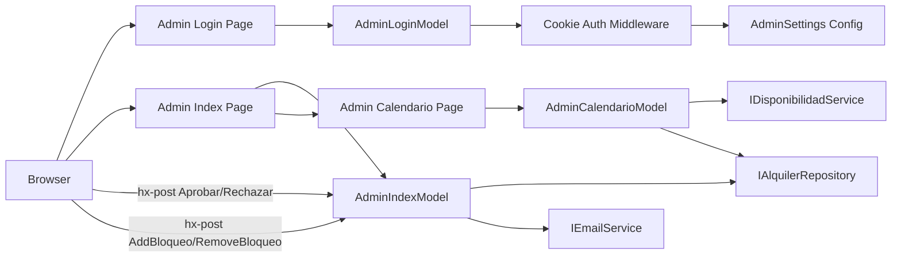
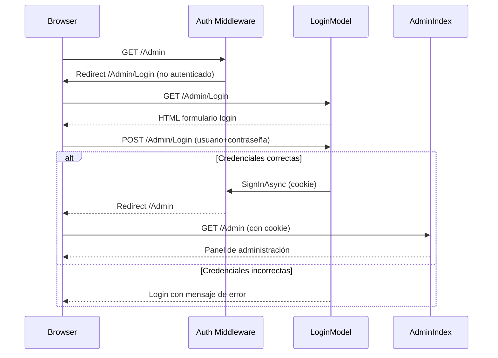
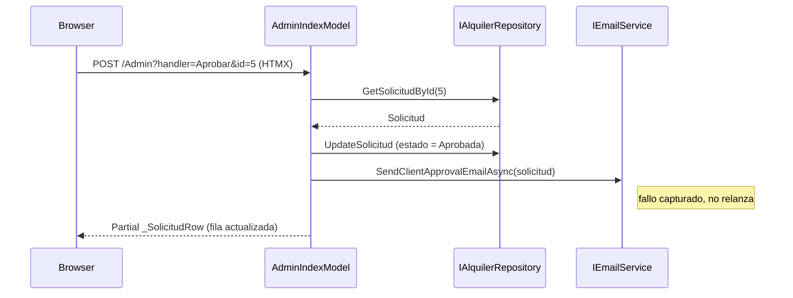

# Design Document: panel-administracion

## Overview

Este spec añade el panel de gestión para el propietario. Desde `/Admin`, el propietario puede ver y gestionar solicitudes de alquiler (aprobar/rechazar con email automático al cliente), añadir y eliminar bloqueos de fechas, y consultar un calendario mensual con la ocupación completa. El acceso está protegido con autenticación por cookie nativa de ASP.NET Core.

**Users**: El propietario del negocio de alquiler de máquinas recreativas.  
**Impact**: Añade un área `/Admin` completa con autenticación, tres Razor Pages de administración, partials HTMX, y extiende `IEmailService` con métodos de notificación al cliente.

### Goals
- Panel protegido accesible solo con credenciales válidas
- Listado completo de solicitudes con acciones de aprobar/rechazar inline (HTMX)
- Emails automáticos al cliente al aprobar o rechazar
- Gestión de bloqueos de fecha con efecto inmediato en el calendario público
- Vista de calendario admin con solicitudes y bloqueos superpuestos

### Non-Goals
- Roles múltiples de administrador
- Histórico de cambios o auditoría de acciones
- Estadísticas o reportes de ocupación
- Integración con calendarios externos (Google Calendar)
- Edición del catálogo de máquinas desde el panel

---

## Boundary Commitments

### This Spec Owns
- Área `/Admin`: rutas, layout y todas las páginas de administración
- `Pages/Admin/Index.cshtml` y `.cs` — listado de solicitudes + handlers de aprobación/rechazo + gestión de bloqueos
- `Pages/Admin/Login.cshtml` y `.cs` — formulario de login y validación de credenciales
- `Pages/Admin/Calendario.cshtml` y `.cs` — vista de calendario admin
- Partials admin: `_SolicitudRow.cshtml`, `_BloqueosLista.cshtml`, `_CalendarioAdmin.cshtml`
- `Models/BloqueoFechaInputModel.cs` — modelo de formulario para bloqueos
- Configuración `AdminSettings` (`Username`, `Password`) en `appsettings.json`
- Middleware de autenticación Cookie en `Program.cs`

### Out of Boundary
- Roles múltiples o permisos granulares de admin
- Auditoría o histórico de cambios de estado
- Estadísticas, dashboards o reportes
- Edición de máquinas del catálogo
- Flujo de solicitud público (responsabilidad de `calendario-solicitudes`)

### Allowed Dependencies
- `infraestructura`: `IAlquilerRepository`, `Solicitud`, `BloqueoFecha`, `EstadoSolicitud` (P0)
- `calendario-solicitudes`: `IEmailService`, `SmtpEmailService`, `IDisponibilidadService` — este spec **extiende** su interfaz y reutiliza su implementación (P0)
- `Microsoft.AspNetCore.Authentication.Cookies` — en el metapaquete ASP.NET Core 10, sin NuGet adicional (P0)
- `IOptions<AdminSettings>` — patrón de configuración del BCL (P0)

### Revalidation Triggers
- Cambio en firma de `IAlquilerRepository.UpdateSolicitud`, `AddBloqueo`, `RemoveBloqueo` → revisar handlers admin
- Cambio en `EstadoSolicitud` enum → revisar lógica de aprobación/rechazo y vistas
- Cambio en `IEmailService` (métodos de cliente añadidos aquí) → revisar `SmtpEmailService` y cualquier mock de tests
- Cambio en credenciales de `AdminSettings` → actualizar `appsettings.json` de desarrollo

---

## Architecture

### Architecture Pattern & Boundary Map



- **Patrón**: Razor Pages + Cookie Authentication + HTMX handlers.
- **Auth**: `AddAuthentication(CookieAuthenticationDefaults.AuthenticationScheme)` + `AddCookie(options => options.LoginPath = "/Admin/Login")`. Todas las páginas admin con `[Authorize]`.
- **Acciones inline**: Handlers `OnPostAprobar(int id)`, `OnPostRechazar(int id)`, `OnPostAddBloqueo()`, `OnPostRemoveBloqueo(int id)` retornan partials HTML que HTMX intercambia en el DOM sin recarga.

### Technology Stack

| Layer | Choice | Role |
|-------|--------|------|
| Backend | ASP.NET Core 10 Razor Pages | PageModels, handlers HTMX, routing |
| Auth | Cookie Authentication (BCL) | Protección del área `/Admin` |
| Frontend | HTMX 2.x CDN | Acciones inline (aprobar/rechazar/bloqueos), navegación de calendario |
| Email | `IEmailService` extendido | Notificación al cliente en aprobación/rechazo |
| Data | `IAlquilerRepository` | Lectura/escritura de solicitudes y bloqueos |
| Config | `appsettings.json` | Credenciales admin + SMTP (compartido) |

---

## File Structure Plan

### Directory Structure

```
Pages/
└── Admin/
    ├── _ViewStart.cshtml          # Layout admin (puede heredar el global o definir uno propio)
    ├── Index.cshtml               # Panel principal: lista de solicitudes + formulario de bloqueos
    ├── Index.cshtml.cs            # AdminIndexModel: OnGet, OnPostAprobar, OnPostRechazar, OnPostAddBloqueo, OnPostRemoveBloqueo
    ├── Login.cshtml               # Formulario de login
    ├── Login.cshtml.cs            # AdminLoginModel: OnGet, OnPostAsync (validar + SignInAsync)
    ├── Calendario.cshtml          # Vista de calendario admin
    ├── Calendario.cshtml.cs       # AdminCalendarioModel: OnGet, OnGetMes
    └── Shared/
        ├── _SolicitudRow.cshtml   # Partial: fila de solicitud con acciones (estado + botones inline)
        ├── _BloqueosLista.cshtml  # Partial: listado de bloqueos activos con botón de eliminar
        └── _CalendarioAdmin.cshtml # Partial: grid mensual con solicitudes y bloqueos superpuestos
Models/
└── BloqueoFechaInputModel.cs      # Modelo de formulario: FechaInicio, FechaFin, Motivo
```

### Modified Files
- `Program.cs` — añadir `AddAuthentication(Cookie)`, `AddAuthorization()`, `Configure<AdminSettings>`, `app.UseAuthentication()`, `app.UseAuthorization()`
- `appsettings.json` — añadir sección `AdminSettings`: `Username`, `Password`
- `Services/IEmailService.cs` — añadir: `Task SendClientApprovalEmailAsync(Solicitud solicitud)`, `Task SendClientRejectionEmailAsync(Solicitud solicitud)`
- `Services/SmtpEmailService.cs` — implementar los dos nuevos métodos

---

## System Flows

### Flujo de autenticación y acceso al panel



### Flujo de aprobación con email inline



---

## Requirements Traceability

| Req | Summary | Componentes |
|-----|---------|-------------|
| 1 | Panel protegido con credenciales | `AdminLoginModel`, `AdminSettings`, `Program.cs` (cookie auth), `[Authorize]` |
| 2 | Listado de solicitudes con datos y acciones | `AdminIndexModel.OnGet`, `Index.cshtml`, `_SolicitudRow.cshtml` |
| 3 | Aprobación con email al cliente | `AdminIndexModel.OnPostAprobar`, `IEmailService.SendClientApprovalEmailAsync`, `_SolicitudRow.cshtml` |
| 4 | Rechazo con email al cliente | `AdminIndexModel.OnPostRechazar`, `IEmailService.SendClientRejectionEmailAsync`, `_SolicitudRow.cshtml` |
| 5 | Gestión de bloqueos de fecha | `AdminIndexModel.OnPostAddBloqueo/RemoveBloqueo`, `BloqueoFechaInputModel`, `_BloqueosLista.cshtml` |
| 6 | Calendario admin con visión completa | `AdminCalendarioModel`, `_CalendarioAdmin.cshtml`, `IDisponibilidadService`, `IAlquilerRepository` |

---

## Components and Interfaces

| Componente | Capa | Intent | Reqs | Dependencias (P0/P1) | Contratos |
|------------|------|--------|------|----------------------|-----------|
| `AdminLoginModel` | Presentación | Valida credenciales y establece cookie de sesión | 1 | `IOptions<AdminSettings>` (P0), Cookie Auth (P0) | State |
| `AdminIndexModel` | Presentación | Orquesta listado, aprobación/rechazo y bloqueos | 2, 3, 4, 5 | `IAlquilerRepository` (P0), `IEmailService` (P0) | State |
| `AdminCalendarioModel` | Presentación | Vista de calendario mensual con solicitudes y bloqueos | 6 | `IDisponibilidadService` (P0), `IAlquilerRepository` (P0) | State |
| `_SolicitudRow.cshtml` | UI Partial | Fila de solicitud con acciones inline HTMX | 2, 3, 4 | `Solicitud` model (P0) | — |
| `_BloqueosLista.cshtml` | UI Partial | Lista de bloqueos activos con acción de eliminar | 5 | `BloqueoFecha` list (P0) | — |
| `_CalendarioAdmin.cshtml` | UI Partial | Grid mensual con solicitudes pendientes/aprobadas + bloqueos | 6 | `AdminCalendarioModel` (P0) | — |
| `BloqueoFechaInputModel` | Modelo | Formulario de alta de bloqueo con validación | 5 | — | State |
| Extensión `IEmailService` | Servicio | Nuevos métodos de email para aprobación/rechazo al cliente | 3, 4 | `SmtpEmailService` (P0) | Service |

### Capa Presentación

#### AdminLoginModel

| Field | Detail |
|-------|--------|
| Intent | Muestra el formulario de login, valida credenciales contra `AdminSettings` y establece la cookie de sesión |
| Requirements | 1 |

**Contracts**: State [x]

```csharp
public class AdminLoginModel : PageModel
{
    [BindProperty] public string Username { get; set; } = string.Empty;
    [BindProperty] public string Password { get; set; } = string.Empty;
    public string? ErrorMessage { get; private set; }

    public void OnGet();
    public async Task<IActionResult> OnPostAsync();
}
```
- `OnPostAsync()`: compara `Username` y `Password` con `AdminSettings`; si correctos, llama `HttpContext.SignInAsync` con `ClaimsPrincipal` y redirige a `/Admin`; si incorrectos, asigna `ErrorMessage` y renderiza el formulario.
- La comparación de credenciales no revela cuál campo es incorrecto en el mensaje de error.

**Implementation Notes**
- `AdminSettings` en `appsettings.json`: `{ "Username": "admin", "Password": "change-me-in-production" }`. Documentar que en producción se debe usar un hash o variable de entorno.
- Risks: contraseña en plaintext en configuración — aceptable para desarrollo/localhost; documentado.

---

#### AdminIndexModel

| Field | Detail |
|-------|--------|
| Intent | Orquesta el listado de solicitudes, las acciones de aprobación/rechazo y la gestión de bloqueos |
| Requirements | 2, 3, 4, 5 |

**Contracts**: State [x]

```csharp
[Authorize]
public class AdminIndexModel : PageModel
{
    public IReadOnlyList<Solicitud> Solicitudes { get; private set; }
    public IReadOnlyList<BloqueoFecha> Bloqueos { get; private set; }
    [BindProperty] public BloqueoFechaInputModel NuevoBloqueo { get; set; } = new();

    public void OnGet();
    public IActionResult OnPostAprobar(int id);
    public IActionResult OnPostRechazar(int id);
    public IActionResult OnPostAddBloqueo();
    public IActionResult OnPostRemoveBloqueo(int id);
}
```
- `OnPostAprobar(id)`: obtiene solicitud, actualiza estado a `Aprobada`, llama `SendClientApprovalEmailAsync` en try/catch, retorna `Partial("_SolicitudRow", solicitud)`.
- `OnPostRechazar(id)`: ídem con `Rechazada` y `SendClientRejectionEmailAsync`.
- `OnPostAddBloqueo()`: si `ModelState.IsValid`, crea `BloqueoFecha` y llama `AddBloqueo`, retorna `Partial("_BloqueosLista", bloqueos)`. Si inválido, retorna partial con errores.
- `OnPostRemoveBloqueo(id)`: llama `RemoveBloqueo(id)`, retorna `Partial("_BloqueosLista", bloqueos)`.

---

#### Extensión de IEmailService

Añadir a `Services/IEmailService.cs`:
```csharp
Task SendClientApprovalEmailAsync(Solicitud solicitud);
Task SendClientRejectionEmailAsync(Solicitud solicitud);
```
- Ambos métodos en `SmtpEmailService`: envían email al `solicitud.EmailCliente` con asunto y cuerpo apropiados (confirmación o rechazo).
- Mismo patrón try/catch que `SendOwnerNotificationAsync`: fallo capturado, no relanzado.

---

## Data Models

### BloqueoFechaInputModel

```csharp
public class BloqueoFechaInputModel
{
    [Required] public DateOnly FechaInicio { get; set; }
    [Required] public DateOnly FechaFin { get; set; }
    public string? Motivo { get; set; }
}
```
- **Invariant**: `FechaFin >= FechaInicio` — validado en `OnPostAddBloqueo` antes de llamar al repositorio; si falla, retorna el partial de bloqueos con error.

---

## Error Handling

### Error Strategy
- **Credenciales incorrectas**: `AdminLoginModel.OnPostAsync` asigna `ErrorMessage` y re-renderiza el formulario sin revelar qué campo falló.
- **Solicitud no encontrada en aprobación/rechazo**: si `GetSolicitudById` retorna null, retorna `Content("<p>Solicitud no encontrada.</p>", "text/html")`.
- **Fallo de email en aprobación/rechazo**: el estado ya fue actualizado; el email falla silenciosamente con log de error. No revierte el cambio de estado.
- **Bloqueo con FechaInicio > FechaFin**: retorna partial `_BloqueosLista` con mensaje de error de validación.
- **Acceso sin autenticación**: el middleware redirige a `/Admin/Login` automáticamente.

---

## Testing Strategy

- **Unit tests**:
  - `AdminLoginModel.OnPostAsync` con credenciales correctas: llama `SignInAsync` y redirige a `/Admin`.
  - `AdminLoginModel.OnPostAsync` con credenciales incorrectas: no llama `SignInAsync`, asigna `ErrorMessage`.
  - `AdminIndexModel.OnPostAprobar(id)`: actualiza estado a `Aprobada` en repositorio y retorna partial `_SolicitudRow`.
  - `AdminIndexModel.OnPostAddBloqueo` con `FechaInicio > FechaFin`: no llama `AddBloqueo` en repositorio.

- **Integration tests**:
  - `GET /Admin` sin autenticación: redirige a `/Admin/Login`.
  - `GET /Admin` con cookie válida: devuelve HTTP 200 con lista de solicitudes.
  - `POST /Admin?handler=Aprobar&id=X` con solicitud existente: estado cambia a `Aprobada`, retorna partial HTML de la fila.
  - `POST /Admin?handler=AddBloqueo` con fechas válidas: bloqueo guardado en repositorio, aparece en lista.
  - `POST /Admin?handler=RemoveBloqueo&id=X`: bloqueo eliminado del repositorio.

- **E2E**:
  - El propietario navega a `/Admin`, es redirigido a login, introduce credenciales correctas, accede al panel.
  - El propietario aprueba una solicitud: la fila se actualiza inline (HTMX) mostrando estado `Aprobada`.
  - El propietario añade un bloqueo: aparece en la lista de bloqueos y las fechas quedan ocupadas en el calendario público.
